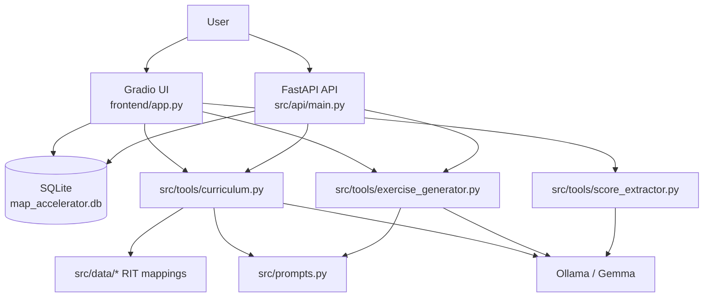
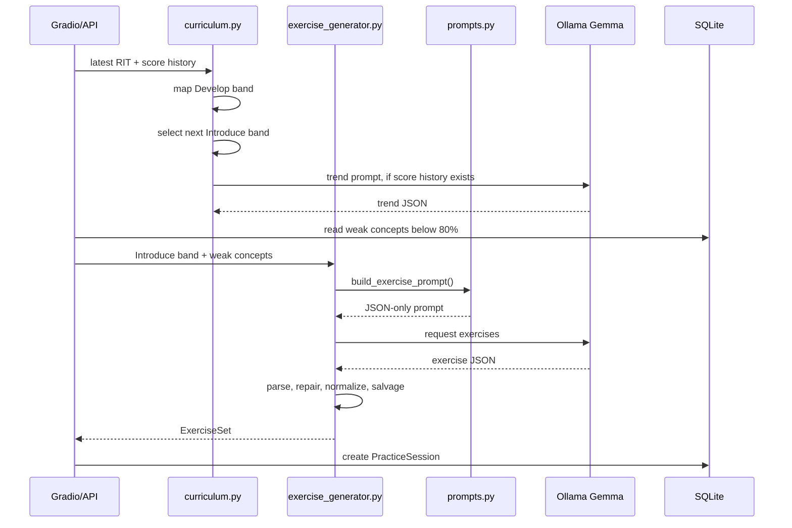

# Architecture

Gemma Adaptive Tutor is a local-first Python app that turns MAP Growth scores into curriculum bands, generated practice, and parent/teacher reports. The main runtime paths are the Gradio frontend in `frontend/app.py`, the optional FastAPI backend in `src/api/main.py`, the SQLAlchemy database in `src/models/database.py`, and the model-facing tools in `src/tools/`.

## Runtime Entry Points

- `just app` runs `uv run python -m frontend` and starts the Gradio UI on port `7860`.
- `just api` runs `uv run python -m src.api.main` and exposes the REST API.
- `just docker` starts the app and Ollama through Docker Compose.
- Both app paths use the same SQLite database, schemas, curriculum tools, and Gemma prompts.

## Frontend Flow

`frontend/app.py` owns the interactive product experience. It initializes the database, builds subject-specific tabs for Math, Reading, and Science, and coordinates three workflows:

1. **Scores**: users select or create a student, manually enter scores, or upload a report for extraction through `src/tools/score_extractor.py`.
2. **Practice**: the app maps the latest score to curriculum bands, calls `generate_exercises()`, renders each question type, grades answers, and records session results.
3. **Report**: the app aggregates practice history, calls `generate_report()`, and renders the model-written narrative beside computed progress data.

The frontend directly uses SQLAlchemy sessions through `SessionLocal`; it does not call the FastAPI service.

## System Flow

## API Flow

`src/api/main.py` provides an alternate programmatic interface:

- `POST /students` creates a student and initial scores.
- `POST /students/{id}/scores` upserts scores by `(student_id, subject, season, year)`.
- `GET /curriculum/{id}` maps the latest score to Develop and Introduce bands.
- `POST /exercises/{id}` generates exercises and creates a practice session.
- `POST /sessions/{id}/complete` stores answer results and concept-level scores.
- `GET /progress/{id}` aggregates mastery across completed sessions.
- `GET /report/{id}` generates a parent/teacher report.

The API and frontend share the same lower-level tools, so behavior should remain consistent when changing schemas, prompts, or curriculum logic.

## Database Model

The SQLite database is `map_accelerator.db`. Models are defined in `src/models/database.py`:

- `Student`: name, current grade, scores, practice sessions, cached analyses.
- `Score`: RIT score by subject, season, year, and grade-at-test.
- `PracticeSession`: generated practice attempt, band, score, and per-concept totals.
- `ExerciseResultRecord`: individual submitted answers.
- `StudentAnalysis`: cached curriculum/trend result per `(student_id, subject)`.

`compute_scores_hash()` supports cache invalidation for analysis results. `init_db()` creates tables and checks that subject-aware columns exist; it does not perform migrations.

## Model And Prompt Pipeline

All public prompt builders live in `src/prompts.py`.

1. `map_rit_to_curriculum()` in `src/tools/curriculum.py` loads `src/data/rit_to_concept_<subject>_2plus.json`, finds the current Develop band, selects the next Introduce band, and optionally calls `detect_trend()`.
2. `detect_trend()` builds a timeline, injects NWEA norms from `src/constants.py`, calls Gemma through Ollama with `format="json"`, and parses a `Trend`.
3. `generate_exercises()` builds an exercise prompt from the Introduce band, calls Gemma, parses JSON, repairs common JSON defects, normalizes fields, salvages usable exercises, and retries for missing items.
4. `generate_report()` summarizes completed sessions, builds a report prompt, and returns free-form Markdown.
5. `score_extractor.py` extracts uploaded score reports by regex first, then Gemma text parsing, then Gemma vision fallback for images or rendered PDF pages.

The model name comes from `src/constants.py` as `MODEL`.

## Practice Generation Sequence

## Responsibility Map

- `frontend/app.py`: UI state, form handling, charts, question rendering, answer grading.
- `src/api/main.py`: REST endpoints and API-oriented persistence flow.
- `src/models/schemas.py`: Pydantic contracts shared by UI, API, and tools.
- `src/models/database.py`: persistence models and database setup.
- `src/tools/curriculum.py`: RIT band mapping, NWEA timeline construction, trend parsing, analysis cache helpers.
- `src/tools/exercise_generator.py`: exercise/report model calls, JSON parsing, validation, repair, and salvage.
- `src/tools/score_extractor.py`: PDF/image/text report extraction.
- `src/prompts.py`: prompt templates and model-facing output contracts.
- `src/constants.py`: supported subjects, model name, NWEA norms, percentile helpers, and data paths.

## Change Guidance

When changing data shape, update `src/models/schemas.py`, any affected SQLAlchemy model, frontend rendering, API endpoints, and prompt documentation together. When changing prompt output, update parsing and validation in `src/tools/` before relying on the new response. When changing curriculum JSON, verify band lookup, topic/concept names, and generated exercise topic validation.
